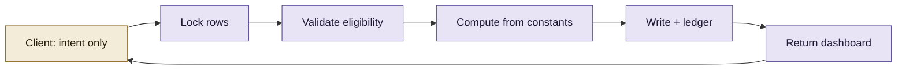
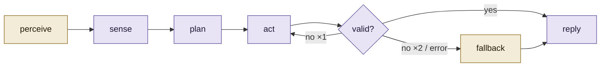

# Architecture Decision Records — Questbound

Each record follows: **Context → Decision → Consequences**. Status is *Accepted* unless noted. Diagrams use two tones only: gold (`#f3ecd9` / `#8c6a1e`) for user-facing or chosen paths, violet (`#e8e4f5` / `#5b4b9a`) for server/internal.

| # | Decision |
| --- | --- |
| [ADR-001](#adr-001-server-authoritative-progression) | Server-authoritative progression |
| [ADR-002](#adr-002-custom-cookie-sessions-instead-of-a-baas) | Custom cookie sessions instead of a BaaS |
| [ADR-003](#adr-003-postgresql--drizzle-relational-over-document) | PostgreSQL + Drizzle (relational over document) |
| [ADR-004](#adr-004-immutable-completions-ledger) | Immutable completions ledger |
| [ADR-005](#adr-005-non-linear-curves) | Non-linear curves |
| [ADR-006](#adr-006-no-punishment-mechanics) | No punishment mechanics |
| [ADR-007](#adr-007-streaks-in-the-users-time-zone-with-shields) | Streaks in the user's time zone, with shields |
| [ADR-008](#adr-008-optimistic-ui-with-authoritative-reconciliation) | Optimistic UI with authoritative reconciliation |
| [ADR-009](#adr-009-derived-achievements-no-table) | Derived achievements (no table) |
| [ADR-010](#adr-010-single-dashboard-read-model) | Single dashboard read model |
| [ADR-011](#adr-011-a-local-naive-bayes-model-before-any-llm) | A local Naive Bayes model before any LLM |
| [ADR-012](#adr-012-openai-compatible-multi-provider-llm-adapter) | OpenAI-compatible multi-provider LLM adapter |
| [ADR-013](#adr-013-a-bounded-agent-loop-with-validated-output) | A bounded agent loop with validated output |
| [ADR-014](#adr-014-safety-rails-on-the-oracle) | Safety rails on the Oracle |
| [ADR-015](#adr-015-weekly-boss-with-one-way-damage) | Weekly boss with one-way damage |
| [ADR-016](#adr-016-transparent-variable-rewards) | Transparent variable rewards |
| [ADR-017](#adr-017-proxyts-as-a-cheap-gate-not-the-auth-boundary) | `proxy.ts` as a cheap gate, not the auth boundary |
| [ADR-018](#adr-018-theming-via-css-custom-properties) | Theming via CSS custom properties |
| [ADR-019](#adr-019-dark-fantasy-guild-ledger-theme) | Dark-fantasy guild-ledger theme |
| [ADR-020](#adr-020-borrowed-features-from-other-apps) | Borrowed features from other apps |
| [ADR-021](#adr-021-innerloop-deterministic-core-llm-periphery) | InnerLoop: deterministic core, LLM periphery |
| [ADR-022](#adr-022-quest-events-as-a-second-ledger) | quest_events as a second ledger |
| [ADR-023](#adr-023-plan-state-is-quest-metadata-not-new-tasks) | Plan state is quest metadata, not new tasks |

---

## ADR-001: Server-authoritative progression

**Context.** The brief demands a backend that prevents users from "easily cheating their stats". A client-only RPG can be edited from DevTools in seconds.

**Decision.** The client never sends XP, gold, streak or level. It sends *intent* (`POST /api/quests/:id/complete`). The server recomputes everything from constants in `src/lib/game.ts` inside a transaction with `SELECT … FOR UPDATE` on the user and quest rows, then returns the authoritative dashboard.

**Consequences.**
- ✅ Tampering with the client changes only what the user sees until the next response.
- ✅ Double taps and multi-device races cannot double-claim.
- ⚠️ Each mutation costs one extra read (`getDashboard`) — accepted for simplicity and consistency.

---

## ADR-002: Custom cookie sessions instead of a BaaS

**Context.** Clerk/Supabase/NextAuth were allowed. The project also had to run in a sandbox with no third-party credentials.

**Decision.** Implement sessions directly: bcrypt (cost 11) for passwords; a 256-bit random token in an `HttpOnly`, `SameSite=Lax` cookie; only the SHA-256 of the token stored in `sessions`; 30-day expiry; opportunistic cleanup of expired rows.

**Consequences.**
- ✅ No vendor lock-in, zero external dependencies, works offline in CI.
- ✅ A database leak does not leak usable session tokens.
- ⚠️ No OAuth / magic links in v1 — a future ADR could add them behind the same `sessions` table.

---

## ADR-003: PostgreSQL + Drizzle (relational over document)

**Context.** The domain is relational: users own quests, quests produce completions, items are held in inventories.

**Decision.** PostgreSQL with Drizzle ORM. Enums for attribute/difficulty/type/category/rarity; foreign keys with `ON DELETE CASCADE` (user-owned rows) or `SET NULL` (completions keep history when a quest is deleted).

**Consequences.**
- ✅ Row locks and transactions are first-class (needed by ADR-001).
- ✅ Aggregations for heatmap, weekly XP and boss damage are single `GROUP BY` queries.
- ⚠️ Schema changes need `drizzle-kit push`; documented in the README.

---

## ADR-004: Immutable completions ledger

**Context.** The brief calls for "complex historical logs". Users also delete and edit quests.

**Decision.** Every completion inserts a row into `completions` snapshotting title, attribute, difficulty, XP, gold, crit, multiplier and streak-at-the-time. Rows are never updated or deleted by the app; deleting a quest sets `quest_id` to `NULL` but keeps the row.

**Consequences.**
- ✅ The Chronicle, heatmap, weekly chart, boss damage, daily contract and achievements all derive from one source of truth.
- ✅ Editing a quest's difficulty later does not rewrite history.
- ⚠️ Table grows unbounded; indexed on `(user_id)` and `(quest_id, completed_on)`.

---

## ADR-005: Non-linear curves

**Context.** Required by the brief; also research on mastery (Koster) and goal-gradient (Kivetz et al.) suggests visible, increasing distance with a visible remaining amount.

**Decision.** Character XP per level = `⌊100 · n^1.5⌋`; attribute level = `⌊√(xp/40)⌋ + 1`. Both are pure functions in `game.ts` shared by client previews and server truth.

**Consequences.**
- ✅ Early levels arrive fast (endowed progress); later levels feel earned.
- ✅ UI always shows "N XP to next level".

---

## ADR-006: No punishment mechanics

**Context.** Diefenbach & Müssig (2019) found Habitica's HP loss during busy periods was the most prevalent counter-productive effect and predicted motivation decline. Prospect theory says losses loom ~2× larger than gains.

**Decision.** No HP, no XP loss, no gold fines, no "damage" for missed dailies. A broken streak resets to 1 on the next completion and is framed as a fresh start (Dai, Milkman & Riis).

**Consequences.**
- ✅ Safe to come back after a bad week.
- ⚠️ Slightly weaker loss-aversion pull — compensated by streak multipliers, boss damage and contracts (gains, not losses).

---

## ADR-007: Streaks in the user's time zone, with shields

**Context.** UTC midnight makes streaks break at 5:30 pm in Delhi. Duolingo's public results show streak freezes reduce churn.

**Decision.** Store an IANA `timezone` per user (captured at signup/login). "Today" is computed with `Intl.DateTimeFormat`. Streak Shields are purchasable (max 3) and consumed automatically when exactly one day is missed. Display uses a read-only `effectiveStreak` so a lapsed streak shows 0 without mutating until the user acts.

**Consequences.**
- ✅ Correct for travellers and night owls.
- ✅ Mercy is a purchasable, visible mechanic — it participates in the economy.

---

## ADR-008: Optimistic UI with authoritative reconciliation

**Context.** The brief: "the user should never feel bogged down by network latency."

**Decision.** `useGuild` applies an optimistic estimate (using the shared engine with `critRoll = 1`) immediately, tracks an in-flight counter, and only accepts a server snapshot when no other mutation is pending (`applyServer`). On error it restores the pre-mutation snapshot and refreshes.

**Consequences.**
- ✅ Sub-frame feedback; the level-up overlay waits for server confirmation so it is never wrong.
- ⚠️ A rare crit means the number the user first saw goes *up* on reconciliation — a pleasant surprise, never a downgrade.

---

## ADR-009: Derived achievements (no table)

**Decision.** Achievements are predicates over `{ totalCompletions, level, longestStreak, gold, itemsOwned, attributeLevels }` evaluated at read time.

**Consequences.** ✅ New achievements are a one-line addition; nothing to backfill. ⚠️ No "unlocked at" timestamp — acceptable for v1.

---

## ADR-010: Single dashboard read model

**Decision.** `GET /api/dashboard` (and every progression mutation) returns one object: profile, quests, history, shop, boss, heatmap, week, check-ins. The Guild page server-renders it on first load.

**Consequences.** ✅ One round-trip to reconcile everything; SSR first paint with a matching skeleton. ⚠️ Payload grows with features — history is capped at 40 rows, heatmap at 84 days.

---

## ADR-011: A local Naive Bayes model before any LLM

**Context.** The user asked for a "basic trained model" that answers emotionally, and the app must work in environments without any API key.

**Decision.** `src/lib/emotion.ts` trains a multinomial Naive Bayes classifier at module load from a labelled seed corpus (8 emotions), with negation folding (`not_good`) and bigrams. It is used (a) to label check-ins, (b) as a grounding hint passed to the LLM, and (c) as the complete fallback reply engine via CBT-shaped templates.

**Consequences.**
- ✅ Zero dependencies, sub-millisecond, private (text never leaves the server), deterministic.
- ✅ "Retraining" = editing `TRAINING_DATA`.
- ⚠️ Small corpus → weak on sarcasm and mixed emotions; confidence is exposed so the UI and LLM can discount it.

---

## ADR-012: OpenAI-compatible multi-provider LLM adapter

**Context.** The user wanted Gemini, NVIDIA, Groq or "any personal API key".

**Decision.** Talk only to the OpenAI-compatible `/chat/completions` wire format. Presets for Gemini (`generativelanguage.googleapis.com/v1beta/openai`), Groq, NVIDIA NIM and OpenAI; `custom` accepts any base URL (Ollama, LM Studio, OpenRouter). Provider is chosen by `AI_PROVIDER` or inferred from which `*_API_KEY` is present. Keys are read server-side only.

**Consequences.**
- ✅ One code path, no SDKs, swappable with an env change.
- ⚠️ Tool-calling schemas differ across providers, so the agent uses **JSON output + validation** rather than native function calling (see ADR-013).

---

## ADR-013: A bounded agent loop with validated output

**Context.** "Agentic" must not mean "unbounded".

**Decision.** `runOracle` is a fixed pipeline: *perceive → sense → plan → act → reflect → (fallback)*. Tools are deterministic server functions (board insights), not model-invoked. Output must satisfy a Zod schema; on failure the model gets exactly one repair turn; on a second failure or any transport error the local fallback answers. Total timeout 20 s. Every step is recorded in a trace the UI can show.

**Consequences.**
- ✅ Predictable latency and cost; no runaway loops; explainable to the user.
- ✅ Suggested quests are validated against the same enums as the quest form, so "Accept" can never create an invalid quest.

---

## ADR-014: Safety rails on the Oracle

**Context.** Woebot/Wysa literature is positive on sentiment-aware CBT micro-skills but consistently flags the need for escalation pathways in severe cases.

**Decision.** A crisis regex runs on every message; when it matches, a fixed helpline line is prepended regardless of provider output. The system prompt forbids guilt-tripping and punishment framing. UI copy states the Oracle is a companion, not a clinician. Conversation can be cleared by the user at any time.

**Consequences.** ✅ Consistent minimum behaviour across LLMs. ⚠️ Regex will miss oblique phrasing — it is a floor, not a diagnosis.

---

## ADR-015: Weekly boss with one-way damage

**Context.** Habitica's boss fights are its most-loved social feature, but they damage the party when dailies are missed (ADR-006 forbids that).

**Decision.** A deterministic boss per ISO week (`bossForWeek`). HP scales with level; damage = XP earned since Monday (a `SUM` over the ledger). Defeating it unlocks a one-time claim per week, tracked by `last_boss_claim_week`.

**Consequences.** ✅ Reuses the ledger; no new tables. ✅ Pure upside — a second goal-gradient on top of levels. ⚠️ Solo only; a party/guild boss is a future ADR.

---

## ADR-016: Transparent variable rewards

**Context.** Variable-ratio reinforcement is powerful (Skinner; Schultz) and easily abused (loot boxes).

**Decision.** One visible 10 % critical-hit chance with fixed multipliers, rolled server-side and logged (`crit` flag in the ledger). No paid randomness, no hidden odds, no real money anywhere.

**Consequences.** ✅ Excitement without slot-machine ethics. ✅ Crits are never required to progress.

---

## ADR-017: `proxy.ts` as a cheap gate, not the auth boundary

**Context.** Next.js 16 renamed `middleware.ts` to `proxy.ts` (Node runtime). A stale cookie plus page-level DB checks can loop redirects.

**Decision.** The proxy only redirects anonymous visitors away from `/guild` (cookie presence check). It does **not** redirect `/login` or `/signup` when a cookie exists; those pages verify the session against the database themselves.

**Consequences.** ✅ Real 307 before any render for anonymous users. ✅ No redirect loops with stale cookies (verified in smoke tests).

---

## ADR-018: Theming via CSS custom properties

**Decision.** All colours are CSS variables under `[data-theme]`, bridged into Tailwind with `@theme inline`. Purchased themes just change the attribute on the app root.

**Consequences.** ✅ Runtime theme switching with no re-render of styles; five palettes (one light) with contrast checked. ⚠️ Arbitrary Tailwind values containing `color-mix()` are fragile — such rules live in `globals.css`.

---

## ADR-019: Dark-fantasy guild-ledger theme

**Context.** The brief penalises "generic SaaS" looks and demands cohesion.

**Decision.** A single metaphor — an adventurer's guild ledger — drives typography (Cinzel + Nunito Sans), vocabulary (Quests, Seal, Abandon, Armory, Chronicle, Sanctum, Oracle), materials (gilded glass panels, wax-seal buttons, candle timer) and motion (sparks, flame, confetti).

**Consequences.** ✅ Every new feature has an obvious name and look. ⚠️ Fantasy tone is a taste; the Parchment theme offers a calmer light variant.

---

## ADR-020: Borrowed features from other apps

**Context.** The user asked to study systems already doing this and include improved versions.

| Source app | Borrowed | Our adjustment |
| --- | --- | --- |
| Habitica | Boss fights, dailies/habits/to-dos | One-way damage (ADR-015); no HP |
| Duolingo | Streaks, streak freeze, XP charts | Shields are purchasable and auto-applied; streak cap keeps pressure bounded |
| Finch / Daylio | Mood check-ins, companion | Mood auto-labelled by the local model; companion is an agent, not a pet |
| Forest / Pomodoro | Focus timer | Timer is bound to a quest and seals it on completion |
| GitHub | Contribution heatmap | 12 weeks, gold scale, keyboard-accessible titles |
| Woebot / Wysa | Sentiment-aware CBT micro-dialogue | Grounded in the user's actual board; crisis floor (ADR-014) |

**Consequences.** ✅ Familiar patterns lower the learning curve. ✅ Each borrowed mechanic is filtered through ADR-006 (no punishment) and ADR-016 (transparent rewards).

---

## ADR-021: InnerLoop: deterministic core, LLM periphery

**Context.** The adaptive layer (Plan My Day, replanning, sizing) must *always* work — including deployments with `AI_PROVIDER=local` and with all keyless gateways down or rate-limited.

**Decision.** All time budgeting, quest size buckets (Tiny/Small/Medium/Large/Epic), budget packing, rebalance fitting, deadlines, next-quest selection, and every reward number are computed in `src/lib/innerloop/*.ts` with zero model calls. LLMs are invoked only at the edges: **naming** generated quests, **naming** split children, writing the natural-language "why the plan changed" explanation, and polishing the weekly summary. Every LLM call has a deterministic template fallback, and plan sizing is re-enforced server-side after any model answer (`difficulty`/minutes/size come from OUR skeleton, never the model).

**Consequences.**
- ✅ A hero can plan, split, rebalance and review with no AI gateway at all.
- ✅ Model failure degrades names/explanations, never correctness.
- ⚠️ Writing prompts for 3 distinct call sites up-front, but they share one OpenAI-compatible fetch helper shape.

---

## ADR-022: quest_events as a second ledger

**Context.** `completions` proves what the hero *did*. The adaptive engine also needs what they *planned and abandoned* — activity completions never see.

**Decision.** A second append-only ledger, `quest_events` (started / completed / abandoned / postponed / rescheduled / split / scheduled), with FK `quest_id … ON DELETE SET NULL` mirroring ADR-004 so deleting a quest never rewrites behavioural history. Insights (ADR-sized aggregation in `innerloop/behavior.ts`) are computed from `completions + quest_events`, with minimum-sample thresholds before any rate is claimed, and every visible insight carries its observed evidence line.

**Consequences.**
- ✅ Postponement-rate and best-time-of-day claims are provable from data.
- ✅ Table grows like completions did; indexed on `(user_id, created_at)`, `(quest_id)`, `(user_id, scheduled_for)`.
- ⚠️ Writing events is fire-and-forget in the API layer — a lost event costs an insight, never a reward.

---

## ADR-023: Plan state is quest metadata, not new tasks

**Context.** "Plan my day" produces quests. The wrong move would have been creating a parallel `tasks` table beside `quests`.

**Decision.** Scheduling is additive metadata ON `quests` itself: `scheduled_for`, `scheduled_order`, `estimated_minutes`, `parent_quest_id`, `goal_id`, `plan_context (jsonb)`, `quest_status (active|postponed|split)`. Planned work flows through the *existing* completion pipeline, XP/gold/streak engine, Chronicle, boss damage and contracts automatically, because it literally IS a quest. Splitting a quest creates child quest rows pointing back (`parent_quest_id`, `SET NULL` on delete) and marks the parent `quest_status='split'` so it leaves the board.

**Consequences.**
- ✅ No duplicated reward logic anywhere; ADR-001's server authority untouched.
- ✅ Migration is 7 nullable columns + 3 small tables (`goals`, `plan_sessions`, `quest_events`) — zero breaking change for existing rows.
- ⚠️ Old quests simply show no planning chips in the UI (all fields nullable).

---

## ADR-024: Sandbox demo mode is a dev-only auth bypass over embedded Postgres

**Status.** Accepted (2026-09)

**Context.** Reviewers and sandboxes need the full app without a Supabase project or cloud database. Auth (GoTrue JWTs) and Postgres are hard external dependencies; stubbing them per-screen would fork the UI.

**Decision.** One env flag, `QUESTBOUND_DEV_AUTH_BYPASS=1`, makes `getSessionUser()` (`src/lib/auth.ts`) and the edge proxy (`src/proxy.ts`) impersonate a fixed demo hero (`auth_id 00000000-0000-4000-8000-000000000001`) instead of calling Supabase. The gate is triple-locked: the flag must be set **and** `NODE_ENV !== "production"` **and** `!process.env.VERCEL`, so a production build or any Vercel deploy silently ignores it even if the variable leaks. Data comes from `scripts/sandbox-db.mjs` (embedded Postgres under `.cache/sandbox-pg`, full 0000→0004 migration set plus Supabase `anon`/`authenticated`/`auth.uid()` shims so `0003` applies verbatim) and `scripts/sandbox-seed.mjs` (idempotent demo hero with two weeks of history: check-ins, plan, goal, completions, events).

**Consequences.**
- ✅ One-command demo: `npm run sandbox:db` + `npm run sandbox:seed` + `npm run dev` (with `.env.local` as in the repo's sandbox runs).
- ✅ Zero production impact: the bypass replaces only where the identity comes from, never the profile/reward pipeline; Vercel ignores the flag outright.
- ⚠️ Sign-in/up/out screens are unreachable while the flag is on (every page resolves the demo hero) — intended.
