# Flows — Questbound

Step-by-step user journeys and the request paths behind them. Diagrams use two tones: gold for user-facing / client steps, violet for server / database steps.

| Flow | Section |
| --- | --- |
| 1 | [First visit → signup → Guild Hall](#1-first-visit--signup--guild-hall) |
| 2 | [Sign in & session lifecycle](#2-sign-in--session-lifecycle) |
| 3 | [Posting a quest](#3-posting-a-quest) |
| 4 | [Sealing (completing) a quest](#4-sealing-completing-a-quest) |
| 5 | [Level-up](#5-level-up) |
| 6 | [Streak day-to-day](#6-streak-day-to-day) |
| 7 | [Daily Guild Contract & Weekly Boss](#7-daily-guild-contract--weekly-boss) |
| 8 | [Armory: buy, equip, use](#8-armory-buy-equip-use) |
| 9 | [Talking to the Oracle](#9-talking-to-the-oracle) |
| 10 | [Mood check-in](#10-mood-check-in) |
| 11 | [Candle focus timer](#11-candle-focus-timer) |
| 12 | [Client state & reconciliation](#12-client-state--reconciliation) |
| 13 | [Error, offline & edge-case handling](#13-error-offline--edge-case-handling) |
| 14 | [Navigation map](#14-navigation-map) |

---

## 1. First visit → signup → Guild Hall

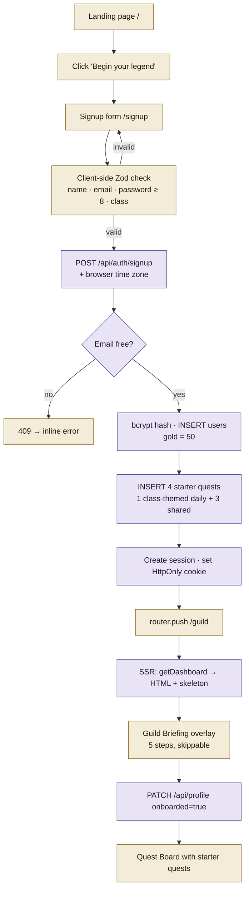

**Steps**
1. The landing page is server-rendered with SEO metadata and JSON-LD; the CTA changes to "Enter the Guild Hall" if a session already exists.
2. Signup validates with the same Zod schema on both client and server (`signupSchema`).
3. On success the server seeds starter quests (`starterQuestsFor(classKey)`) so the board is never empty.
4. `/guild` is a server component: it verifies the session against the DB, builds the dashboard, and streams it; `loading.tsx` shows a matching skeleton.
5. The Briefing shows until `onboarded_at` is set; it can be reopened later with `?` or the sheet button.

---

## 2. Sign in & session lifecycle

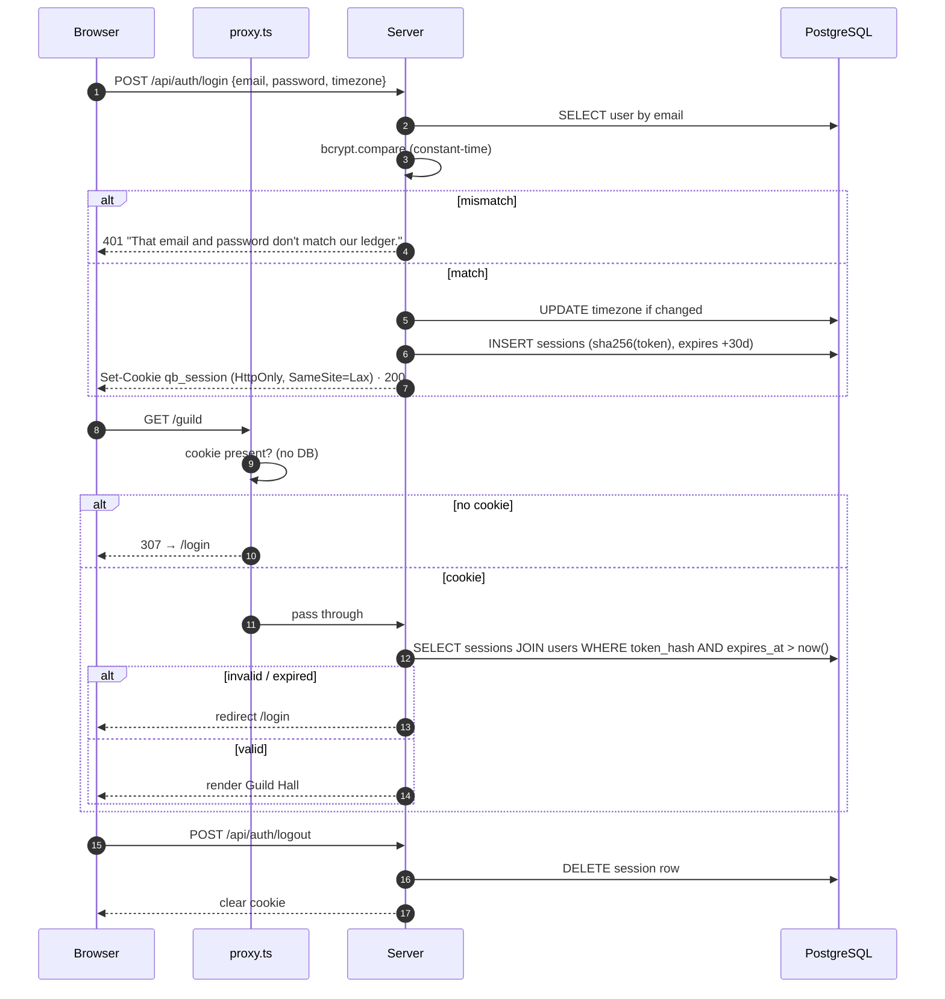

Rate limiting: 12 login attempts per email+IP per 15 min; 10 signups per IP per 15 min (429 with friendly copy).

---

## 3. Posting a quest

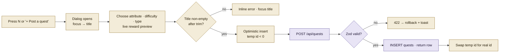

- The reward preview calls the same `computeReward` the server uses, with `critRoll = 1` (no crit) and the *next* streak value.
- While the temp id is negative the card's seal/edit/delete buttons are disabled to avoid acting on an unsaved row.
- Editing uses `PATCH /api/quests/:id` with a partial schema; deleting shows an inline "Abandon?" confirm, then `DELETE`.

---

## 4. Sealing (completing) a quest

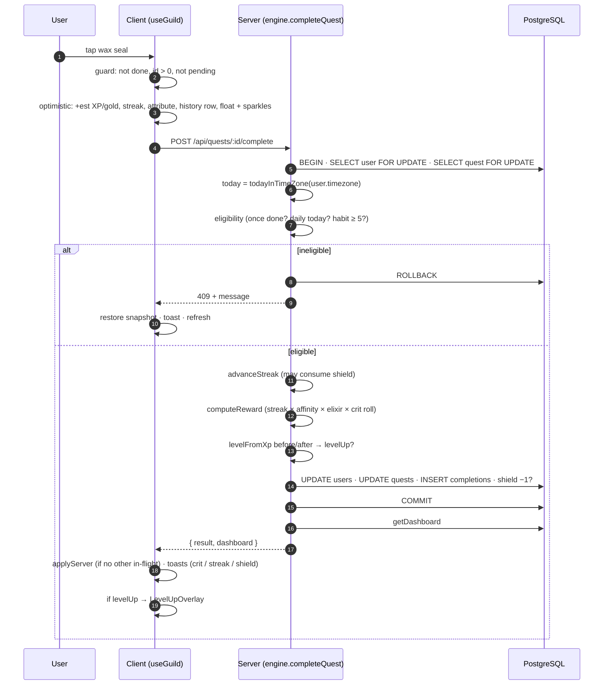

Reward math (server): `xp = round(base.xp × streakMult × affinity × boost × critXp)`, `gold = round(base.gold × critGold)`. Level-up bonus gold is added in the same transaction.

---

## 5. Level-up

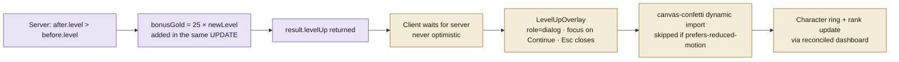

---

## 6. Streak day-to-day

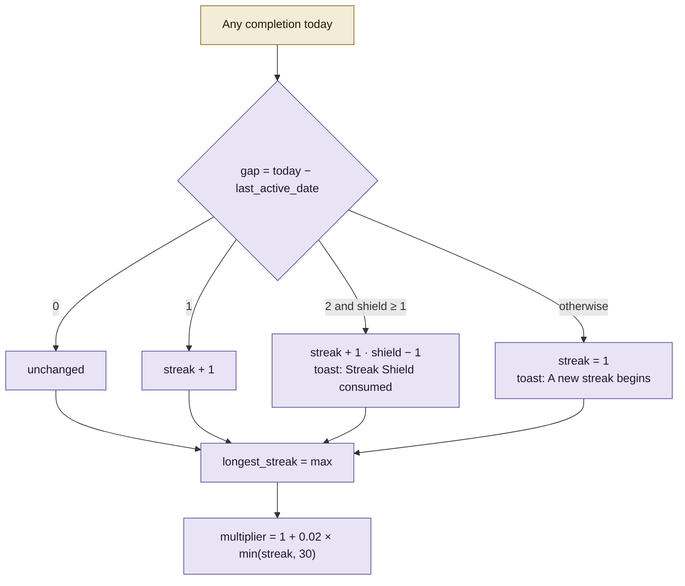

Display rule (`effectiveStreak`, read-only): if the last active day was neither today nor yesterday and no shield covers a two-day gap, the sheet shows **0** and "Complete any quest to light the flame." Nothing is mutated until the user acts.

---

## 7. Daily Guild Contract & Weekly Boss

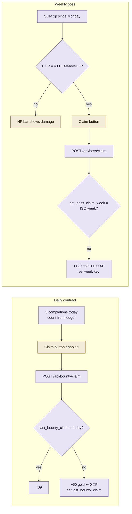

Both are claimed inside a locked transaction; both may trigger a level-up which flows through §5.

---

## 8. Armory: buy, equip, use

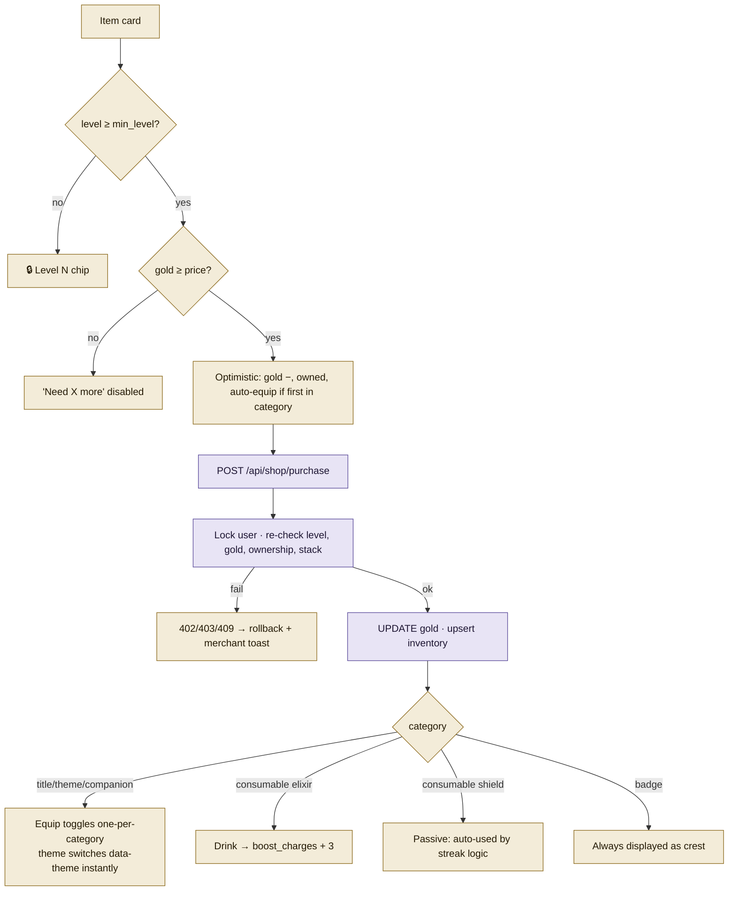

---

## 9. Talking to the Oracle

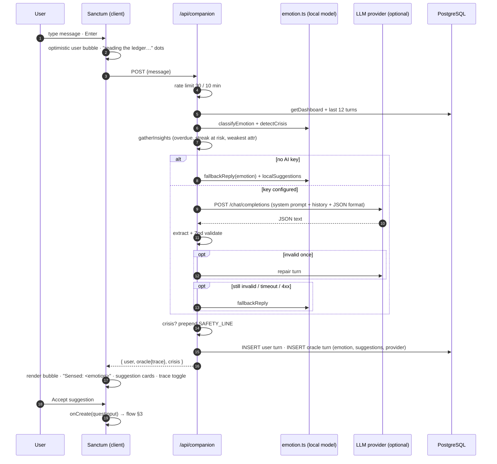

---

## 10. Mood check-in

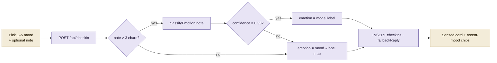

---

## 11. Candle focus timer

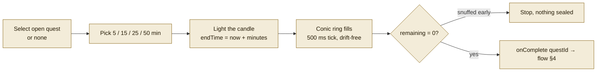

The timer is client-side by design: the *completion* is still authorised by the server like any other seal.

---

## 12. Client state & reconciliation

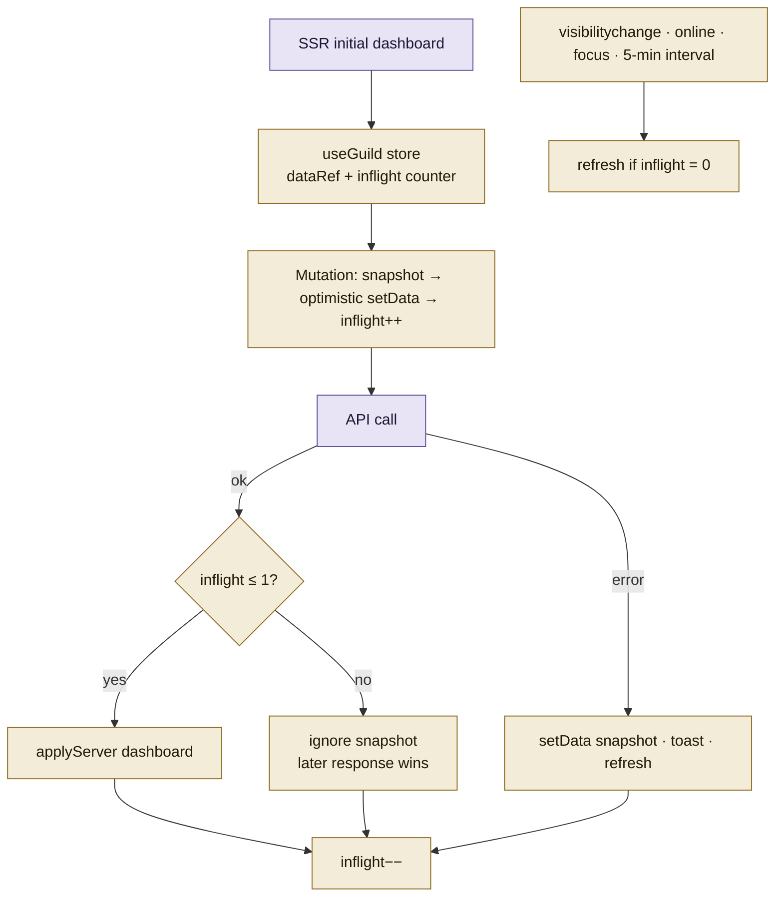

---

## 13. Error, offline & edge-case handling

| Situation | Behaviour |
| --- | --- |
| Empty / whitespace title | Client inline error; server 422 `"Give your quest a name"` |
| Double-tap seal | Button disabled while pending; server row lock + eligibility → 409 on the second |
| Daily already done | 409 `"Already done today — this daily returns at dawn."` |
| Habit > 5/day | 409 with cap message |
| Not enough gold | Client disables button with shortfall; server 402 if raced |
| Level-gated item | 🔒 chip; server 403 |
| Network drop | `navigator.onLine` banner; failed calls roll back with a toast; resync on `online` |
| Session expired | API 401 → client redirects to `/login`; page-level check also redirects |
| Stale cookie on `/login` | Page verifies against DB and renders normally (no loop) |
| LLM provider down / bad JSON | One repair attempt, then local-model fallback; trace shows why |
| Crisis language | Helpline line always prepended, regardless of provider |
| Day rollover mid-session | Refresh on focus recomputes `today` in the user's zone |
| Reduced motion | Confetti, sparks, shimmer and count-ups disabled |

---

## 14. Navigation map

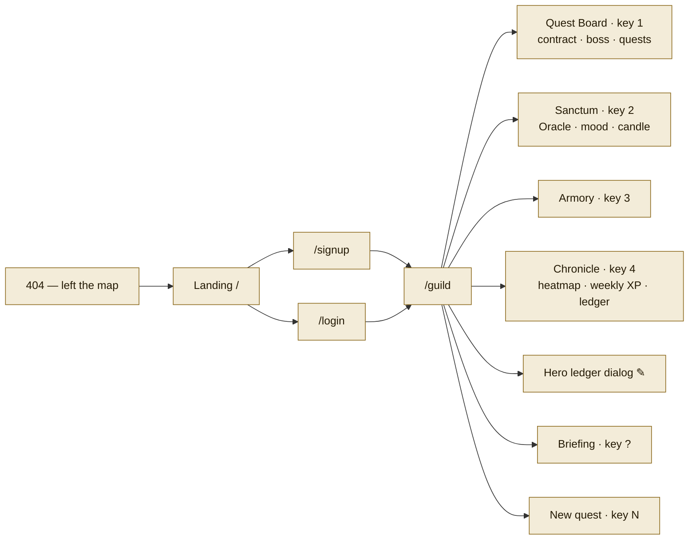

Desktop shows a `role="tablist"`; mobile shows a fixed bottom navigation with the same four destinations.
