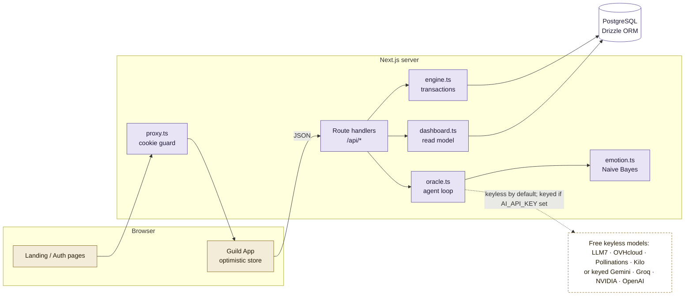
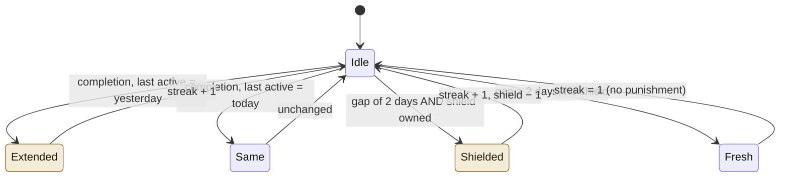
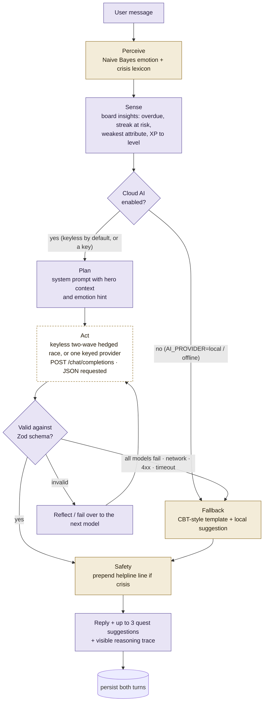
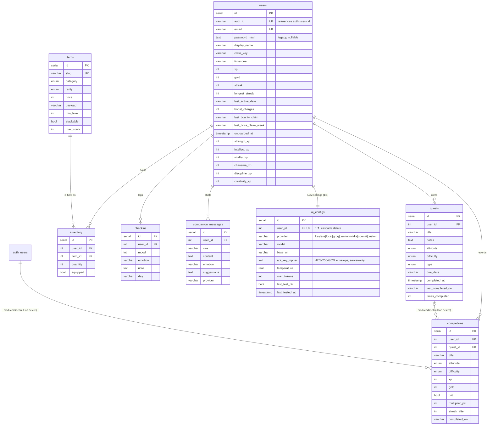
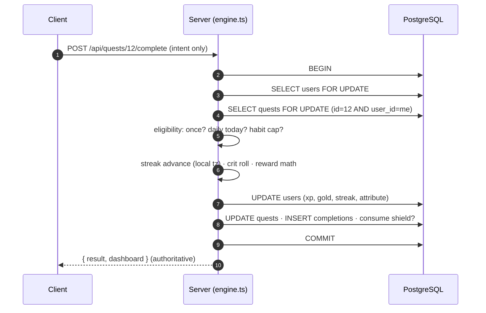

# ⚜ Questbound — a Life RPG

> **Community extension (September 2026):** The existing Supabase social schema is now connected to `/community`, `/guilds`, `/challenges`, `/leaderboard` and `/heroes/[id]`. See [implementation, migration and verification notes](docs/COMMUNITY_IMPLEMENTATION.md). Use `npm run db:check` / `npm run db:migrate` for this populated database; destructive `db:push` is guarded off.


> Every task is a quest. Every day is a chapter.

Questbound turns real-world tasks into an RPG progression system. Quests pay **XP** and **gold**, six **attributes** level up depending on what you do, **streaks** multiply rewards (and can be protected by shields), gold is spent in the **Armory**, a **weekly boss** absorbs the XP you earn, and an emotion-aware **Oracle** companion sizes your next quest to how you actually feel. Every reward is calculated **on the server inside a database transaction**, so the client can be fast and playful without ever being trusted.

| Document | What it covers |
| --- | --- |
| `README.md` (this file) | Setup, features, architecture, API, schema |
| [`FLOW.md`](./FLOW.md) | User journeys and request flows, step by step, with sequence diagrams |
| [`DECISIONS.md`](./DECISIONS.md) | Architecture Decision Records — *why* each major choice was made |
| [`RESEARCH.md`](./RESEARCH.md) | Product + AI research (sources → design rules), the 2026 free-model survey, and the full implementation docs |
| [`DEPLOYMENT.md`](./DEPLOYMENT.md) | Step-by-step hosting guide — Vercel + Supabase, env vars, migrations |

---

## Table of contents

1. [Stack](#stack)
2. [Quick start](#quick-start)
3. [Environment variables](#environment-variables)
4. [Features](#features)
5. [Architecture](#architecture)
6. [Game engine](#game-engine)
7. [The Oracle (agentic companion)](#the-oracle-agentic-companion)
8. [Database schema](#database-schema)
9. [API reference](#api-reference)
10. [Security & anti-cheat](#security--anti-cheat)
11. [Accessibility, performance & SEO](#accessibility-performance--seo)
12. [Project structure](#project-structure)
13. [Deployment](#deployment)
14. [Demo video checklist](#demo-video-checklist)

---

## Stack

| Layer | Technology |
| --- | --- |
| Frontend | Next.js 16 (App Router), React 19, Tailwind CSS v4, Motion, canvas-confetti |
| Backend | Next.js Route Handlers (Node runtime), Zod validation |
| Database | PostgreSQL (Supabase) via Drizzle ORM — works with any Postgres |
| Auth | **Supabase Auth (GoTrue)** through `@supabase/ssr` — httpOnly JWT cookies; a linked `public.users` profile holds the character sheet |
| AI (zero setup) | Keyless free OpenAI-compatible models (LLM7 · OVHcloud · Pollinations · Kilo) raced with failover; add a key for Gemini, Groq, NVIDIA NIM, OpenAI or a custom endpoint |
| Local ML | Dependency-free multinomial Naive Bayes emotion classifier trained at boot (`src/lib/emotion.ts`) — the always-available fallback |

---

## Quick start

### Prerequisites
- Node.js 20+
- PostgreSQL 14+

```bash
git clone <your-fork-url> questbound
cd questbound
npm install
cp .env.example .env        # set DATABASE_URL + Supabase keys (see DEPLOYMENT.md)
# create tables: local Postgres → npx drizzle-kit push ; Supabase → see DEPLOYMENT.md
npm run dev                 # http://localhost:3000
```

The app expects `DATABASE_URL` plus the Supabase variables described in
[`DEPLOYMENT.md`](./DEPLOYMENT.md). The Armory catalogue seeds itself on the
first request (idempotent upsert by slug).

| Script | Purpose |
| --- | --- |
| `npm run dev` | Development server |
| `npm run build` / `npm start` | Production build / start |
| `npm run typecheck` | `tsc --noEmit` |
| `npm run lint` | ESLint |
| `npx drizzle-kit push` | Apply schema changes |

---

## Environment variables

See [`.env.example`](./.env.example) for the full template.

| Variable | Required | Purpose |
| --- | --- | --- |
| `DATABASE_URL` | ✅ | PostgreSQL connection string (Supabase transaction pooler in production) |
| `NEXT_PUBLIC_SUPABASE_URL` | ✅ | Your Supabase project URL, e.g. `https://<ref>.supabase.co` |
| `NEXT_PUBLIC_SUPABASE_ANON_KEY` | ✅ | Supabase publishable/anon key (safe in the browser) |
| `SUPABASE_URL` / `SUPABASE_ANON_KEY` | recommended | Server-side copies of the same two values |
| `NEXT_PUBLIC_SITE_URL` | recommended | Canonical URL for metadata, sitemap, robots |
| `AI_PROVIDER` | optional | A keyless id (`llm7` \| `ovh-nemo` \| `pollinations` \| `kilo-nemotron` \| `ovh` \| `kilo`), a keyed id (`gemini` \| `groq` \| `nvidia` \| `openai` \| `custom`), or `local` to disable cloud AI |
| `AI_ALLOW_KEYLESS` | optional | `false` turns off the anonymous free-model ensemble (default on) |
| `AI_API_KEY` | optional | Your key for a keyed provider (server-side only); takes precedence over keyless |
| `AI_MODEL`, `AI_BASE_URL` | optional | Override the model / endpoint defaults |
| `GEMINI_API_KEY` / `GROQ_API_KEY` / `NVIDIA_API_KEY` / `OPENAI_API_KEY` | optional | Recognised if `AI_API_KEY` is empty; provider is inferred |
| `APP_ENCRYPTION_KEY` | recommended | Master key for AES-256-GCM encryption of per-user LLM API keys in `ai_configs` (`openssl rand -base64 48`); if unset, one is derived from server secrets |

**Per-user override:** the variables above set the deployment-wide default, but each hero can pick their own provider/key in **Settings → AI / LLM** (see [The Oracle → per-user configuration](#per-user-ai--llm-configuration-settings--ai--llm)). A saved override always wins for that user.

**With no configuration at all** the Oracle already runs on a hedged ensemble of
free, keyless models (LLM7 → OVHcloud Mistral Nemo → Pollinations → Kilo, with
heavier backstops), validating every reply against a schema and falling back to
the local Naive Bayes model with CBT-style templates if every endpoint is
unavailable. Add a provider key for more stable, stronger replies. Keys never
reach the browser. See [`RESEARCH.md`](./RESEARCH.md) for the model survey and
failover design.

---

## Features

### Core (problem-statement checklist)

| Requirement | Implementation |
| --- | --- |
| Auth & security | Supabase Auth (JWT verified server-side), httpOnly cookies, per-user scoping, rate limiting |
| CRUD | Quests: create / read / update / delete / complete, all optimistic with rollback |
| Non-linear levelling | `⌊100 · n^1.5⌋` XP per level; quadratic attribute curves |
| Streaks | Time-zone-aware, +2 %/day XP multiplier (cap +60 %), Streak Shields absorb a missed day |
| Attributes | Strength, Intellect, Vitality, Charisma, Discipline, Creativity — each quest trains one |
| Economy | Gold → 17 Armory items (titles, 5 themes, companions, crests, consumables) |
| Responsive & accessible | Mobile bottom nav, keyboard tabs/dialogs/shortcuts, live regions, reduced-motion |

### Gamification layer

- **Difficulty tiers** Trivial 10 XP → Epic 150 XP; **class affinity** +15 %; **10 % critical hits** (2× gold, 1.5× XP); **level-up bonus gold** with confetti overlay.
- **Daily Guild Contract** — seal 3 quests, claim +50 gold / +40 XP (once per local day).
- **Weekly Boss** — every XP you earn this week is damage against e.g. *The Procrastinator Wyrm*; slay it for +120 gold / +100 XP. The boss never damages *you* (see ADR-006).
- **12 derived achievements**, immutable **Chronicle** ledger, **12-week heatmap** and **weekly XP chart**.
- **Class-themed starter quests** and a **5-step Guild Briefing** on first visit.

### Sanctum (well-being layer)

- **The Oracle** — emotion-aware agentic companion (details below) that suggests quests you can accept in one tap and shows its reasoning trace.
- **Mood check-in** — 1–5 mood + note, auto-labelled by the emotion model.
- **Candle focus timer** — pick a quest, light a 5/15/25/50-minute candle; when it burns out the quest is sealed.

### Product feel

Optimistic UI, skeleton loading, floating `+XP · +gold`, seal sparkles, count-up numbers, shimmering bars, spring dialogs, toast live-region, offline banner, keyboard shortcuts (`N` new quest, `1–4` tabs, `?` briefing), five switchable colour themes.

---

## Architecture



**Principle:** the client sends *intent* (“complete quest 12”), never values. The server locks rows, validates eligibility, computes rewards from constants, writes the ledger, and returns the authoritative dashboard. The client's optimistic numbers are overwritten by that response.

---

## Game engine

All formulas live in `src/lib/game.ts` (pure, shared by client previews and server truth).

| Mechanic | Formula / rule |
| --- | --- |
| XP for level *n → n+1* | `⌊100 · n^1.5⌋` → 100, 282, 519, 800, 1118 … |
| Attribute level | `⌊√(xp / 40)⌋ + 1` |
| Base rewards | trivial 10/4 · easy 20/8 · medium 40/16 · hard 80/32 · epic 150/64 (XP/gold) |
| Streak multiplier | `1 + 0.02 · min(streak, 30)` |
| Class affinity | ×1.15 XP when quest attribute = class attribute |
| Elixir of Insight | ×2 XP for the next 3 completions |
| Critical hit | 10 % → ×1.5 XP, ×2 gold (rolled server-side) |
| Level-up bonus | `25 × new level` gold |
| Guild Contract | 3 completions/day → +50 gold, +40 XP |
| Weekly boss HP | `400 + 60 · (level − 1)`; damage = XP earned since Monday |



---

## The Oracle (agentic companion)



- **Local model** — `src/lib/emotion.ts`: multinomial Naive Bayes with negation handling and bigrams, 8 labels (`joy, calm, tired, anxious, sad, frustrated, overwhelmed, neutral`), trained at boot from a labelled seed corpus. Extend `TRAINING_DATA` to retrain.
- **Suggestion sizing** — overwhelmed / tired / sad → one trivial quest; anxious → one 5-minute concrete step; joy / calm → medium or hard. Suggestions are validated and become real quests with one tap.
- **Safety** — crisis lexicon always prepends helpline guidance; the Oracle is framed as a companion, not a clinician.
- **Providers** — *zero setup:* a two-wave race of free, keyless models (wave 0: LLM7 Codestral, OVHcloud Mistral Nemo, Pollinations GPT-OSS; wave 1 backstops: Kilo Nemotron, OVH GPT-OSS-120b, Kilo auto) with the fastest valid reply winning and losers aborted. *With a key:* Gemini (default `gemini-3.6-flash`), Groq `llama-3.3-70b-versatile`, NVIDIA `meta/llama-3.3-70b-instruct`, OpenAI `gpt-4o-mini`, or any custom endpoint (override with `AI_MODEL` / `AI_BASE_URL`). Provider endpoints, free models and quotas change often — see [`RESEARCH.md`](./RESEARCH.md).

### Per-user AI / LLM configuration (Settings → AI / LLM)

Each hero configures their own Oracle provider from the dashboard — no redeploy needed:

- **Providers** — Automatic free ensemble (keyless), **Local Model** (Ollama, LM Studio, llama.cpp, any OpenAI-compatible server), **Groq**, **Google Gemini**, **NVIDIA NIM**, **OpenAI**, or any **custom** OpenAI-compatible endpoint.
- **Live model picker** — after a key is entered (or immediately for keyless/local servers), the *Model Name* field becomes a dropdown fetched live from the provider's `/models` catalogue. Hosted catalogues are filtered to chat/text models (Whisper, embeddings, moderation, TTS and image SKUs are hidden); Gemini uses its native `v1beta` catalogue for display names and capabilities, local/custom servers list everything they expose. Stable models appear first, previews in a labelled group, and an **Other — type a model name…** entry always allows manual models.
- **Connection testing** — *Test Connection* validates the base URL, checks reachability, lists models and confirms the chosen model + credentials, with precise failures (unreachable / auth rejected / model missing).
- **Local-first privacy** — a configured local or custom endpoint is the *only* target the Oracle calls; it never silently fails over to a third-party cloud. If it is down, only the on-device Naive Bayes model answers. (On Vercel, `localhost` means Vercel's container — self-host Questbound to use a model on your laptop.)
- **Gemini 3.x** — requests automatically set `reasoning_effort: low` so hidden thinking tokens don't truncate replies within the token budget.
- **Secret handling** — API keys are stored **AES-256-GCM encrypted** in the `ai_configs` table (key from `APP_ENCRYPTION_KEY`, see `.env.example`), never sent to the browser (the UI only receives `hasApiKey`), masked with a show/hide toggle, and stripped from error strings, logs and traces. Temperature and max-tokens are per-user too.

Server implementation lives in `src/lib/ai-settings.ts` (storage, validation, connection tester), `src/lib/ai-models.ts` (catalogues), `src/lib/crypto.ts` (vault) and `src/app/api/settings/ai/` (GET/PUT, `/test`, `/models`).

---

## Database schema



Achievements are **derived** at read time from counts, levels and streaks — no table needed.

---

## API reference

All responses are JSON. Errors are `{ "error": "human-readable message" }` with a meaningful status (401, 402, 403, 404, 409, 422, 429, 500). Every route except auth requires the session cookie and is scoped to that user.

| Method | Route | Body / notes |
| --- | --- | --- |
| POST | `/api/auth/signup` | `{ email, password, displayName, classKey, timezone }` → seeds starter quests |
| POST | `/api/auth/login` | `{ email, password, timezone }` |
| POST | `/api/auth/logout` | Revokes the session |
| GET | `/api/dashboard` | Profile, quests, history, shop, boss, heatmap, week, check-ins |
| GET / POST | `/api/quests` | List / create |
| PATCH / DELETE | `/api/quests/:id` | Update / delete |
| POST | `/api/quests/:id/complete` | Claim reward (transactional) → `{ result, dashboard }` |
| POST | `/api/shop/purchase` | `{ itemId }` |
| POST | `/api/inventory/equip` | `{ itemId }` toggle |
| POST | `/api/inventory/use` | `{ itemId }` consumables |
| POST | `/api/bounty/claim` | Daily Guild Contract |
| POST | `/api/boss/claim` | Weekly boss reward |
| POST | `/api/checkin` | `{ mood: 1-5, note? }` → emotion label + reply |
| GET / POST / DELETE | `/api/companion` | Oracle history / send `{ message }` / clear |
| GET / PUT | `/api/settings/ai` | Read public LLM config (never the key) / save provider, model, base URL, key, temperature, max tokens |
| POST | `/api/settings/ai/test` | Server-side connection test for unsaved/saved values |
| POST | `/api/settings/ai/models` | Live chat-model catalogue for the selected provider |
| PATCH | `/api/profile` | `{ displayName?, classKey?, onboarded? }` |
| GET | `/api/health` | DB liveness |

Mutations that change progression return the **fresh dashboard** so the client can reconcile in one round-trip.

---

## Security & anti-cheat



- Passwords and sessions are managed by **Supabase Auth** (bcrypt-hashed passwords in GoTrue; short-lived JWT + refresh token in httpOnly, `SameSite=Lax` cookies). Each request is re-verified with `auth.getUser()`; the linked `public.users` profile is scoped by the authenticated user id.
- Row locks + eligibility checks mean a double tap or two devices cannot double-claim; a locked user row means concurrent purchases cannot overspend.
- Rate limiting on auth and Oracle endpoints; Zod validation on every body; whitespace-only titles rejected client- and server-side.
- `proxy.ts` issues a real 307 for anonymous `/guild` visits (checking the Supabase auth cookie); pages still verify the JWT (no redirect loops on stale cookies).

---

## Accessibility, performance & SEO

- Skip link, landmarks, single `h1`, labelled inputs with `aria-describedby` errors, `role="tablist"` with Arrow/Home/End, focus-trapped `role="dialog"` with Escape and focus restoration, polite live regions, ≥ 44 px targets, visible focus rings, `prefers-reduced-motion` respected, 4.5:1 contrast in all five themes.
- Server-rendered first paint with a streaming skeleton; `next/font` with `display: swap`; `next/image` hero with `priority`; confetti dynamically imported; optimistic UI so the app feels client-native.
- Semantic landing page, Open Graph / Twitter metadata, JSON-LD `WebApplication`, `sitemap.xml`, `robots.txt` (disallows `/guild`, `/api`).

---

## Project structure

```
src/
├─ app/
│  ├─ page.tsx                    Landing (SEO, JSON-LD)
│  ├─ login/  signup/             Auth pages
│  ├─ guild/                      The app (SSR data + loading skeleton)
│  ├─ not-found.tsx
│  ├─ api/
│  │  ├─ auth/{signup,login,logout}
│  │  ├─ dashboard
│  │  ├─ quests, quests/[id], quests/[id]/complete
│  │  ├─ shop/purchase, inventory/{equip,use}
│  │  ├─ bounty/claim, boss/claim
│  │  ├─ checkin, companion, profile
│  │  └─ health
│  ├─ robots.ts, sitemap.ts, layout.tsx, globals.css
├─ components/
│  ├─ guild/   GuildApp · useGuild (optimistic store) · CharacterSheet · QuestBoard · QuestCard
│  │           QuestForm · Armory · Chronicle · Heatmap · BossBattle · GuildContract
│  │           Sanctum (Oracle chat, mood check-in, candle timer) · LevelUpOverlay
│  │           Briefing · HeroSettings · SparkleBurst
│  ├─ ui/      Toast · Dialog · ProgressBar
│  └─ auth/    AuthForm · AuthShell
├─ lib/
│  ├─ game.ts        Pure engine: curves, rewards, streaks, boss, achievements
│  ├─ engine.ts      Transactional mutations
│  ├─ dashboard.ts   Read model + item seeding
│  ├─ oracle.ts      Agent loop + hedged keyless/keyed LLM ensemble
│  ├─ emotion.ts     Naive Bayes emotion model + CBT templates + crisis lexicon
│  ├─ starters.ts    Class-themed starter quests
│  ├─ auth.ts, api.ts, validation.ts, catalog.ts, dates.ts, types.ts
├─ db/schema.ts, db/index.ts
└─ proxy.ts
```

---

## Deployment

Recommended: **Vercel + Supabase** — full step-by-step instructions, env vars,
the Supavisor pooler URL, migration commands and troubleshooting are in
[`DEPLOYMENT.md`](./DEPLOYMENT.md).

In short: set `DATABASE_URL` (Supabase transaction pooler on port 6543),
`NEXT_PUBLIC_SUPABASE_URL`, `NEXT_PUBLIC_SUPABASE_ANON_KEY` and
`NEXT_PUBLIC_SITE_URL`; the schema is applied once with Drizzle; then
`npm run build` and deploy. Any Node host works (Railway, Render, Fly).

---

## Demo video checklist

1. Sign up (choose a class) → Guild Briefing → starter quests already on the board.
2. Post a quest, seal it — reward float, sparkles, XP bar, gold count-up.
3. Seal an *Epic* quest → level-up overlay with confetti and bonus gold.
4. Sanctum: tell the Oracle “I'm overwhelmed” → accept its suggested quest.
5. Armory: buy and equip a theme.
6. Refresh the page — everything persists (server-rendered from PostgreSQL).
