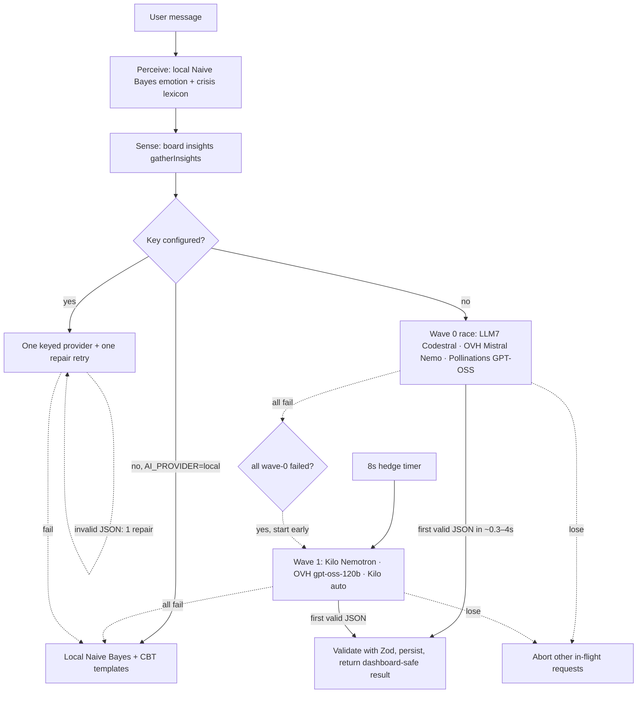

# Questbound — Research & Implementation

> How the product decisions in Questbound were reached, and how they are built.
>
> This document has three parts:
> - **Part 1 — Product research.** What the gamification, motivation, habit
>   and behavioural-economics literature says, distilled into the 40 design
>   rules (**R1–R40**) the product follows.
> - **Part 2 — AI companion research.** A 2026 survey of where an intelligent
>   companion can actually run for free, which models and endpoints work
>   without an API key, and the reliability architecture that makes them usable.
> - **Part 3 — Implementation.** The stack, data model, game engine, agent
>   loop, and a traceability matrix from every research rule to the code that
>   implements it.

---

## Table of contents

1. [Part 1 — Product research foundation](#part-1--product-research-foundation)
2. [Part 2 — AI companion research & model selection](#part-2--ai-companion-research--model-selection)
3. [Part 3 — Implementation](#part-3--implementation)
4. [Appendix — Source map](#appendix--source-map)

---

# Part 1 — Product research foundation

The core hypothesis — *turning real tasks into a game makes people do them* —
is easy to state and easy to get wrong. This part collects the evidence for
**which** game elements work, **why**, and the conditions under which they
backfire, then turns each finding into a concrete rule.

### A. Why games motivate and to-do lists don't

| # | Source | Finding | Design rule |
|---|---|---|---|
| 1 | Deterding, Dixon, Khaled & Nacke (2011), *From game design elements to gamefulness* | Gamification is game design *elements* in non-game contexts; elements ≠ experience. | **R1** Elements must combine into a coherent loop (quest → reward → progression → new quest), not sit as isolated badges. |
| 2 | Hamari, Koivisto & Sarsa (2014), review of 24 studies | Effects are positive but strongly context- and user-dependent. | **R2** Users author their own quests and choose difficulty, so the system adapts to them. |
| 3 | Koivisto & Hamari (2019), review of 800+ studies | Points/badges/leaderboards dominate; long-term effects are rarely measured; novelty wears off. | **R3** Build for months — non-linear curves, level-gated items, evolving titles. |
| 4 | Seaborn & Fels (2015), *Gamification in theory and action* | Theory-light designs underperform. | **R4** Every mechanic maps to a psychological mechanism (this table). |
| 5 | Ryan & Deci (2000), Self-Determination Theory | Intrinsic motivation grows when autonomy, competence and relatedness are satisfied. | **R5** Autonomy: user quests & cosmetics. Competence: visible attribute growth. Relatedness: class identity, companions, guild language. |
| 6 | Ryan, Rigby & Przybylski (2006), motivational pull of games | Enjoyment is predicted by competence + autonomy satisfaction. | **R6** Show competence immediately (XP float, bar fill); autonomy always (edit/delete anything). |
| 7 | Przybylski, Rigby & Ryan (2010) | Need-satisfaction, not "fun features", drives engagement. | **R7** Prefer fewer, deeper systems over many shallow ones. |
| 8 | Sailer, Hense, Mayr & Mandl (2017) | Graphs → competence; avatars, stories, teammates → relatedness. | **R8** Ship performance graphs, an avatar/class, and a story frame (guild, chronicle). |
| 9 | Mekler, Brühlmann, Tuch & Opwis (2017) | Points/levels/leaderboards raise output but not intrinsic motivation by themselves. | **R9** Never rely on points alone; attach meaning (attributes, titles). |
| 10 | Malone (1981) | Intrinsically motivating instruction = challenge + fantasy + curiosity. | **R10** Difficulty tiers (challenge), themed language (fantasy), crits/achievements (curiosity). |
| 11 | Csikszentmihalyi (1990), *Flow* | Clear goals, immediate feedback, challenge/skill balance. | **R11** Feedback under 100 ms via optimistic UI; users pick difficulty to balance challenge. |
| 12 | Koster (2004), *A Theory of Fun* | Fun is learning patterns; mastery curves. | **R12** Attribute levels get harder (quadratic) so mastery keeps meaning. |
| 13 | Bartle (1996); Tondello et al. (2016), Hexad user types | Users differ: Achievers, Free Spirits, Philanthropists, Socialisers, Players, Disruptors. | **R13** Serve Achievers (levels), Free Spirits (themes/companions), Players (gold/crits) at minimum. |
| 14 | Orji, Tondello & Nacke (2018) | Persuasive strategies land differently per Hexad type. | **R14** Cosmetics are optional and never gate core function. |

### B. Progress, feedback and the "small wins" machine

| # | Source | Finding | Design rule |
|---|---|---|---|
| 15 | Amabile & Kramer (2011), *The Progress Principle* | Perceived progress on meaningful work is the strongest daily motivator. | **R15** Every completion visibly moves at least two bars (character XP + attribute XP). |
| 16 | Hull (1932); Kivetz, Urminsky & Zheng (2006), goal-gradient | Effort accelerates as a goal approaches. | **R16** Always show "N XP to next level"; never hide the remaining distance. |
| 17 | Nunes & Drèze (2006), endowed progress | Artificial head-starts increase completion. | **R17** New heroes start with 50 gold; the first Epic quest levels you up. |
| 18 | Locke & Latham (2002), goal-setting | Specific, challenging goals + feedback beat vague ones. | **R18** The quest form forces a specific title, attribute and difficulty. |
| 19 | Schunk (1983), progress self-monitoring | Progress feedback raises self-efficacy. | **R19** The Chronicle shows XP/gold per day and all-time deeds. |
| 20 | Bandura (1977), self-efficacy | Mastery experiences build belief. | **R20** Recommend a Trivial first quest in the empty state. |
| 21 | Zeigarnik (1927) | Unfinished tasks stay salient. | **R21** Open-quest badge on tabs; "today's dailies n/5" bar. |
| 22 | Fredrickson & Kahneman (1993), peak–end rule | Experiences are judged by peak and end. | **R22** Make level-ups a peak (overlay, confetti, bonus gold); end sessions on a celebratory toast. |
| 23 | Fogg (2009/2019), behaviour model / *Tiny Habits* | B = MAP; celebrate immediately to wire a habit. | **R23** Trivial tier = a tiny habit; celebrate in the same animation frame. |
| 24 | Doherty & Thadani (1982), response-time economics | Sub-400 ms keeps users in flow. | **R24** Optimistic updates; reconcile with the server after. |
| 25 | Norton, Mochon & Ariely (2012), IKEA effect | People value what they build. | **R25** User-authored quests, user-named hero, chosen class. |

### C. Streaks, loss aversion and mercy

| # | Source | Finding | Design rule |
|---|---|---|---|
| 26 | Kahneman & Tversky (1979), prospect theory | Losses loom ~2× larger than gains. | **R26** Streaks motivate — but breaking one genuinely hurts; design mercy in. |
| 27 | Diefenbach & Müssig (2019), counter-productive gamification (Habitica) | Punishment (HP loss) during busy periods demotivates; users game the system. | **R27** No punishment mechanics — no HP, no XP loss, no damage for missed dailies. |
| 28 | Toda, Valle & Isotani (2018), dark side of gamification | Performance loss, undesired behaviour, indifference, declining effects. | **R28** Cap multipliers; keep the economy modest; no manipulative notifications. |
| 29 | Duolingo streak/freeze A/B engineering posts | Streak freezes reduce churn after a missed day. | **R29** Streak Shield: purchasable, auto-consumed on a single missed day. |
| 30 | Dai, Milkman & Riis (2014), fresh-start effect | Temporal landmarks motivate restarts. | **R30** A broken streak says "a new streak begins"; frame restarts positively (no 0). |
| 31 | Lally et al. (2010), habit formation | Median 66 days to automaticity; missing one day doesn't derail. | **R31** Streak multiplier caps at 30 days; a miss resumes at 1, not 0. |
| 32 | Gollwitzer (1999), implementation intentions | "When X, then Y" plans double follow-through. | **R32** Quest notes prompt "Why it matters, or where to start." |
| 33 | Milkman, Minson & Volpp (2014), temptation bundling | Pair wants with shoulds. | **R33** Habit quests allow logging pleasant small acts alongside hard ones. |
| 34 | Thaler (1985); Hsee et al. (2003), mental accounting / medium maximisation | People chase intermediate currencies. | **R34** Two currencies: XP (progress, unspendable) and gold (economy, spendable). |

### D. Variable rewards, ethics and honesty

| # | Source | Finding | Design rule |
|---|---|---|---|
| 35 | Skinner (1957); Ferster & Skinner, reinforcement schedules | Variable-ratio schedules produce persistent behaviour. | **R35** A small, transparent 10% crit chance — never hidden odds. |
| 36 | Schultz, Dayan & Montague (1997), prediction & reward | Dopamine spikes on *unexpected* reward. | **R36** Crits are rare, loud, and never required for progression. |
| 37 | Drummond & Sauer (2018), loot boxes ≈ gambling | Paid randomness is harmful. | **R37** No real money; no purchasable randomness. |
| 38 | Kim & Werbach (2016), ethics of gamification | Exploitation, manipulation, harm are real risks. | **R38** Users own their data; one-tap deletion; no guilt notifications. |
| 39 | Deci, Koestner & Ryan (1999), over-justification meta-analysis | Tangible rewards can crowd out intrinsic motivation. | **R39** Rewards are informational (competence feedback), not controlling; no penalties. |
| 40 | Hanus & Fox (2015) | Leaderboards/badges lowered motivation for some students. | **R40** No public leaderboard in v1; achievements are private and derived. |

### E. Additional sources informing the details

- **Habit theory** — Wood & Neal (2007) context cues (dailies reset at *local* dawn); Verplanken & Orbell (2003) habit-strength index ("times completed"); Gardner (2012) habit vs. goal split; Clear (2018) identity-based habits and Bem (1972) self-perception (class + titles); Duhigg (2012) cue–routine–reward loop.
- **Identity & avatars** — Yee & Bailenson (2007) the Proteus effect; Birk et al. (2016) avatar identification raises motivation (avatar ring, companion, title).
- **Gamified productivity evaluations** — Zuckerman & Gal-Oz (2014); Lieberoth (2015); Attali & Arieli-Attali (2015); Denny (2013); Hamari (2017); van Roy & Zaman (2018); Xi & Hamari (2019); Legaki et al. (2020).
- **Health/wellbeing reviews** — Johnson et al. (2016); Looyestyn et al. (2017); Cugelman (2013).
- **Design frameworks** — Werbach & Hunter (2012); Zichermann & Cunningham (2011); Chou (2015) *Octalysis*; Nicholson (2015) *RECIPE*; Kapp (2012); Landers (2014); Schell (2008); Marczewski (2015) Hexad; Huotari & Hamari (2017).
- **Critical perspectives** — Bogost (2011); Juul (2013) *The Art of Failure* (keep effort honest; make failure safe).
- **Behavioural economics/goals** — Heath, Larrick & Wu (1999); Soman & Cheema (2004); Ariely & Wertenbroch (2002); Cialdini (2001).
- **HCI** — Hick's & Fitts's laws (few primary actions, 44 px targets); WCAG 2.2 (focus, contrast, reduced motion); Nielsen heuristics (system-status visibility: skeletons, offline banner, toasts).

---

# Part 2 — AI companion research & model selection

The Oracle is the product's "agentic" surface: it reads **how the user says
they feel** and **the state of their board**, then replies with empathy and
suggests quests sized to that state. The goal was to make it a *real* language
model out of the box — no signup, no credit card — while still working fully
offline and never trusting the client with game math.

## 2.1 The two problems

1. **Perceive emotion on every message, instantly and privately.** A remote
   API is too slow/available-dependent to be the *primary* emotion signal, and
   shipping a heavyweight ML runtime is overkill for eight labels.
2. **Generate an empathetic, structured reply (with quest suggestions)** that
   is constrained enough to turn into real database rows.

## 2.2 Local emotion model (always available)

`src/lib/emotion.ts` implements a dependency-free **multinomial Naive Bayes**
classifier trained at module load from a small labelled seed corpus:

- 8 labels: `joy, calm, tired, anxious, sad, frustrated, overwhelmed, neutral`.
- Tokenisation folds case, strips punctuation, handles **negation**
  (`not good` → `not_good`), and adds **bigrams** for a little context.
- **Laplace smoothing**, log-priors from class frequency, a **softmax** over
  log-likelihoods, and a reported confidence. Tiny, sub-millisecond, runs on
  the server for every check-in and Oracle message.
- A **crisis lexicon** (self-harm phrases) always prepends a safety/escalation
  line regardless of what any LLM returns.
- When no cloud model is reachable, CBT-shaped **template replies**
  (validate → normalise → shrink the step → hand back control) and
  emotion-sized quest suggestions stand in.

Naive Bayes was chosen deliberately: it is interpretable, has no native
build step, trains in microseconds, and degrades to the lexicon/templates
rather than failing. The research basis mirrors Finch & Schneider-style
practical text classification and the CBT "behavioural activation" literature
that tiny, concrete next actions are the most useful response to low mood.

## 2.3 The 2026 free-LLM landscape (researched 2026-09-12)

The cloud layer needed a chat model reachable from the server. Almost all
strong models (Groq, Gemini, NVIDIA, OpenRouter, Mistral, Cerebras…) require a
free **account and key**. A smaller set of aggregators expose genuinely
**keyless, anonymous, OpenAI-compatible** endpoints. The survey drew on:

- freellmpool's 2026 provider catalogue and audit — [free providers list](https://0xzr.github.io/freellmpool/free-llm-api-providers-list.html), [`providers.toml`](https://github.com/0xzr/freellmpool/blob/main/src/freellmpool/providers.toml)
- [awesome-free-llm-apis](https://github.com/amardeeplakshkar/awesome-free-llm-apis)
- [The best free LLM APIs in 2026 (live-probed)](https://wotai.co/blog/best-free-llm-apis)
- [llm4free](https://pypi.org/project/llm4free/) and each provider's own docs.

### Provider comparison

| Provider | Key? | OpenAI-compatible | Models probed | Anonymous limits | Finding |
|---|---|---|---|---|---|
| **LLM7** | optional | `https://api.llm7.io/v1` | `default`, `fast` → routes to `codestral-latest` | ~60 req/h, **1 concurrent** per client | Fastest clean JSON in tests (~0.3–2 s). Fails concurrent calls with a 429. |
| **OVHcloud AI Endpoints** | no | `https://oai.endpoints.kepler.ai.cloud.ovh.net/v1` | `Mistral-Nemo-Instruct-2407`, `gpt-oss-120b`, Llama/Qwen family | Anonymous, per-IP rate limit | Mistral Nemo returned valid JSON in ~1.7 s and was the most reliable non-reasoning model; larger models frequently 429 from a shared IP. |
| **Pollinations** | no | `https://text.pollinations.ai/openai` | `openai` → routes to **gpt-oss** | Per-IP, hourly shared budget | Simple, no auth; the anonymous *shared key* intermittently returns HTTP 200 with a "key budget reached" message → must be treated as a soft failure. |
| **Kilo Gateway** | no | `https://api.kilo.ai/api/gateway` | `kilo-auto/free`, `nvidia/nemotron-3.5-lightning:free`, ~15 more | ~200 req/h per IP | Aggregator of many free routes; some routes return empty content or 404/401, but `nvidia/nemotron-3.5-lightning:free` produced high-quality structured output. |
| **OpenCode Zen** | no | `https://opencode.ai/zen/v1` | DeepSeek/Nemotron routes | Promotional; **routes disabled by default** | Not relied upon. |
| Google **Gemini** | free key | `…/v1beta/openai` | `gemini-2.5-flash` | Free-tier project limits | Strong, native JSON mode; used when a key is supplied. |
| **Groq** | free key | `https://api.groq.com/openai/v1` | `llama-3.3-70b-versatile` | Generous, very fast | Best keyed default for speed. |
| **NVIDIA NIM** | free key | `https://integrate.api.nvidia.com/v1` | `meta/llama-3.3-70b-instruct` | ~15–40 req/min | Strong 70-B model. |
| **OpenAI** | paid key | `https://api.openai.com/v1` | `gpt-4o-mini` | Account billing | Familiar baseline. |
| Custom | — | any `/chat/completions` | user-supplied | — | Ollama, LM Studio, OpenRouter, local gateway, etc. |

### Hard-won integration findings

1. **One protocol everywhere.** Every viable endpoint speaks OpenAI's
   `POST /chat/completions`, so a single client (`chat()` in
   `src/lib/oracle.ts`) covers all providers; only `baseUrl`, `model` and an
   optional bearer token differ.
2. **Native `response_format: { type: "json_object" }` is unsafe on keyless
   gateways** — Pollinations bills/rejects it and some routers ignore it.
   Keyless calls instead request JSON **in the prompt**; a tolerant parser
   strips ```fences and slices the outermost `{ … }`.
3. **"HTTP 200" is not success.** Free routers return 200 with an
   `{"error": …}` body, empty `choices`, or a *sentence* saying the budget is
   exhausted. All are detected and treated as a failed attempt.
4. **Reasoning models burn the token budget on a hidden "thinking" preamble.**
   Nemotron returned `finish_reason: "length"` with no JSON at `max_tokens=600`.
   Reasoning backstops therefore get a larger token budget (1600), run *after*
   fast non-reasoning models, and the parser takes the **last** JSON object.
5. **Free anonymous capacity is volatile and IP-shared.** From a datacenter /
   sandbox IP, quotas are shared and frequently 429; from an ordinary
   deployment or local machine they are far more reliable. No single free
   endpoint can be trusted — only an ensemble with a deterministic fallback.
6. **Never block on the network.** The local Naive Bayes + CBT templates
   guarantee a coherent answer even if every cloud call fails or is disabled.

## 2.4 The architecture chosen: a hedged, two-wave failover race

A strict "try A then B then C" chain is robust on paper but its latency is the
**sum** of every slow failure (a reasoning model hanging to its timeout made
worst-case replies take a minute). Firing *all* models at once trips
single-concurrency limits (LLM7) and wastes quota. The implemented compromise
in `runOracle()`:



- **Wave 0 (immediate, fast non-reasoning):** LLM7 `fast` (Codestral), OVH
  `Mistral-Nemo-Instruct-2407`, Pollinations `openai` (gpt-oss).
- **Wave 1 (8-second hedge, heavier):** Kilo
  `nvidia/nemotron-3.5-lightning:free` (1600 tokens), OVH `gpt-oss-120b`,
  Kilo `kilo-auto/free`. It starts early the moment all wave-0 attempts fail.
- The **first schema-valid reply wins**; every other `fetch` is cancelled via
  `AbortController`. Per-request timeouts are 20 s keyless / 30 s keyed.
- A configured key always wins precedence and is tried alone (with one
  reflection/repair pass on invalid JSON), matching the original design.
- Output is validated against a **Zod** schema; invalid enum values
  (`attribute`, `difficulty`, `type`) cause that attempt to be discarded, so a
  hallucinated category can never reach the database.
- The full reasoning chain (`perceive → sense → plan → act → error/respond`)
  is returned to the UI as a visible **trace** and the chosen `provider` is
  shown on each Oracle message and in the Sanctum header.

### Configuration (`.env`)

| Variable | Effect |
|---|---|
| *(none)* | Keyless ensemble enabled automatically; local model is the final fallback. |
| `AI_ALLOW_KEYLESS=false` | Turn off all anonymous cloud calls (offline/privacy mode). |
| `AI_PROVIDER=local` | Alias for local-only. |
| `AI_PROVIDER=llm7\|ovh-nemo\|pollinations\|kilo-nemotron\|ovh\|kilo` | Pin one free model to the front of the race. |
| `AI_API_KEY` + `AI_PROVIDER=gemini\|groq\|nvidia\|openai\|custom` | Use a keyed provider (takes precedence). |
| `GEMINI_API_KEY` / `GROQ_API_KEY` / `NVIDIA_API_KEY` / `OPENAI_API_KEY` | Provider-specific keys; the provider is inferred if `AI_PROVIDER` is empty. |
| `AI_MODEL`, `AI_BASE_URL` | Override the model / endpoint (also supports a local Ollama-style server). |

Keys are read only by route handlers on the server and never reach the client.

### Reliability notes & honest limitations

- Free anonymous endpoints change model names, quotas and routing without
  notice; the table reflects probes on **2026-09-12**. The ensemble degrades
  gracefully rather than breaking when one changes.
- Through a shared NAT/datacenter IP the larger models (OVH 70B/120B,
  Pollinations shared budget) rate-limit aggressively; Mistral Nemo, LLM7
  Codestral and Kilo Nemotron were the most dependable in testing.
- For production with many users, supply a Groq/Gemini/NVIDIA key — a single
  stable keyed provider replaces the whole race.

---

# Part 3 — Implementation

## 3.1 Stack

| Layer | Technology |
|---|---|
| Frontend | Next.js 16 (App Router), React 19, Tailwind CSS v4, Motion, canvas-confetti |
| Backend | Next.js Route Handlers (Node runtime), Zod validation |
| Database | PostgreSQL via Drizzle ORM |
| Auth | Custom sessions — bcrypt hashes, 256-bit random tokens stored hashed, `HttpOnly`/`SameSite=Lax` cookie |
| AI | Keyless OpenAI-compatible ensemble + optional keyed providers; dependency-free local Naive Bayes |

## 3.2 Directory map

```
src/
├─ app/
│  ├─ page.tsx                  Landing (SEO, JSON-LD, hero image)
│  ├─ login/ signup/            Auth pages (two-column AuthShell with artwork)
│  ├─ guild/                    The app (SSR data + loading skeleton)
│  └─ api/                      auth · dashboard · quests · shop · inventory
│                               · bounty · boss · checkin · companion · profile · health
├─ components/
│  ├─ guild/  GuildApp · useGuild (optimistic store) · CharacterSheet ·
│  │          QuestBoard/QuestCard/QuestForm · Armory · Chronicle · Heatmap ·
│  │          BossBattle · GuildContract · Sanctum (Oracle, mood, candle timer) ·
│  │          LevelUpOverlay · Briefing · HeroSettings · SparkleBurst
│  ├─ ui/     Toast · Dialog · ProgressBar
│  └─ auth/   AuthForm · AuthShell
├─ lib/
│  ├─ game.ts      Pure engine: curves, rewards, streaks, boss, achievements
│  ├─ engine.ts    Transactional mutations (row locks)
│  ├─ dashboard.ts Read model + Armory seeding
│  ├─ oracle.ts    AI configuration, hedged race, agent loop, structured schema
│  ├─ emotion.ts   Naive Bayes classifier + crisis lexicon + CBT templates
│  ├─ catalog.ts · starters.ts · dates.ts · validation.ts · types.ts
│  └─ auth.ts · api.ts · client-api.ts · hooks.ts
├─ db/schema.ts · db/index.ts
└─ proxy.ts
public/images/hero.jpg          Themed guild-ledger artwork (landing + auth)
```

## 3.3 Progression engine (pure, server-authoritative)

Formulas live in `src/lib/game.ts`, shared by client previews and the server's
transactional truth (`src/lib/engine.ts`):

| Mechanic | Rule |
|---|---|
| Character XP for level n→n+1 | `floor(100 · n^1.5)` — non-linear (R3, R16) |
| Attribute level | `floor(√(xp / 40)) + 1` — quadratic mastery curve (R12) |
| Base rewards (XP/gold) | trivial 10/4 · easy 20/8 · medium 40/16 · hard 80/32 · epic 150/64 |
| Streak multiplier | `1 + 0.02 · min(streak, 30)` (+2%/day, capped +60%) |
| Class affinity | ×1.15 XP when quest attribute = class attribute |
| Elixir of Insight | ×2 XP for the next 3 completions |
| Critical hit | 10% → 1.5× XP, 2× gold, rolled server-side and fully disclosed |
| Level-up bonus | `25 × new level` gold plus a confetti overlay (R22) |
| Guild Contract | 3 completions/day → +50 gold, +40 XP |
| Weekly boss HP | `400 + 60 · (level − 1)`; damage = XP earned since Monday |
| Streak mercy | Streak Shield absorbs one 2-day gap; otherwise resume at 1, never 0 (R27–R31) |
| Eligibility | `once` once; `daily` once/local-day; `habit` ≤5/day — enforced inside a locked transaction |

All mutations run inside a database transaction that locks the user row (and
the quest row), so double-taps and concurrent purchases can never double-claim
or overspend. The client sends **intent** ("complete quest 12"), never values;
the server computes every reward and returns the authoritative dashboard.

## 3.4 The Oracle agent loop (end-to-end)

1. **Perceive** — `classifyEmotion(message)` → label + confidence;
   `detectCrisis(message)` → safety flag.
2. **Sense** — `gatherInsights(dashboard)`: open quests, dailies left, overdue
   titles, streak and whether it is at risk, weakest/strongest attribute, XP to
   next level, deeds today, recent completions.
3. **Plan** — build the system prompt with hero context and the emotion hint;
   choose a single keyed provider or the keyless ensemble.
4. **Act** — single provider with one repair retry, or the two-wave hedged
   race (§2.4). Each raw reply is parsed (`extractJson`) and validated
   (`oracleOutputSchema` / `suggestionSchema`).
5. **Safety** — a crisis match prepends the helpline line to *any* reply.
6. **Persist & respond** — both turns are written to `companion_messages`; the
   POST returns `{ user, oracle, crisis }` where `oracle.trace` exposes the
   reasoning chain. A suggestion accepted in the UI becomes a normal quest via
   the same validated create path.

`GET /api/companion` returns history, `POST` sends a message (rate-limited per
user+IP), and `DELETE` clears the conversation.

### Adding or changing a model

- **Pin** an existing free model: set `AI_PROVIDER` to its id.
- **Add a keyless provider:** append an entry to `KEYLESS_TARGETS` in
  `src/lib/oracle.ts` (`id`, `baseUrl`, `model`, `label`, `wave`, optional
  `maxTokens`); add the id to the `Provider` union. It joins the race
  automatically.
- **Add a keyed provider:** add a preset to `KEYED_PRESETS` and (optionally) a
  key env var in `resolveKeyed()`.
- **Retrain the local model:** extend `TRAINING_DATA` in `src/lib/emotion.ts`;
  it rebuilds on next boot.

## 3.5 Research rule → implementation traceability

| Rule(s) | Implemented in |
|---|---|
| R1, R10 coherent loop & fantasy | Themed language + Quest Board → seal → XP/gold → level → Armory/boss |
| R2, R25 autonomy & ownership | Full quest CRUD, chosen class, user-named hero (`QuestForm`, `HeroSettings`) |
| R3, R12 long-term, non-linear | `floor(100·n^1.5)` levels, quadratic attributes, level-gated items (`game.ts`, `catalog.ts`) |
| R4 theory mapping | This document; each mechanic traced above |
| R5, R6, R8 competence/relatedness | Character sheet bars, class identity, companions, titles, guild frame |
| R7 fewer deeper systems | Six attributes feed every quest; one economy; one boss |
| R9 meaning beyond points | Attributes, ranks, titles and derived achievements |
| R11, R24 flow / <400 ms | Optimistic store with rollback (`useGuild.ts`), server reconciliation |
| R13, R14 Hexad breadth, no gating | Levels, cosmetics, crits/gold; cosmetics never gate core function |
| R15 two bars per win | Completion updates character XP **and** the attribute XP |
| R16 goal-gradient | Always-visible "XP to next level" (`CharacterSheet`, `ProgressBar`) |
| R17 endowed progress | New users start at 50 gold |
| R18 specific goals | Required title/attribute/difficulty in `questInputSchema` (Zod) |
| R19 progress monitoring | Chronicle ledger + 12-week heatmap + weekly XP chart |
| R20 mastery first step | Briefing + class starter quests; trivial empty-state suggestion |
| R21 Zeigarnik | Open-quest tab badge; daily completion counters |
| R22, R23 peaks & immediate celebration | `LevelUpOverlay` + confetti, reward floats, `SparkleBurst` |
| R26, R27, R30, R31 mercy | No HP/punishment; Streak Shield; resume at 1; fresh-start copy |
| R28 modest economy | Capped multipliers, bounded shop prices, no push notifications |
| R29 streak freeze | Streak Shield auto-consumed in the completion transaction |
| R32 implementation intentions | Quest notes prompt "Why it matters, or where to start" |
| R33 temptation bundling | Habit quests log pleasant small acts up to 5×/day |
| R34 two currencies | XP (unspendable progress) vs gold (Armory economy) |
| R35, R36 crits | Transparent 10% crit, loud toast, never required to progress |
| R37 no paid randomness | No money at all; fixed-price items only |
| R38 user agency / no guilt | No guilt notifications; users own and can delete their data |
| R39 informational rewards | Rewards framed as competence feedback; zero penalties |
| R40 no leaderboards | Achievements are private, derived at read time |
| HCI (Fitts/Hick/WCAG) | 44 px targets, focus traps, ARIA tabs/dialogs/live regions, reduced motion, five 4.5:1 themes |
| AI: emotion perception | Local Naive Bayes + crisis lexicon (`emotion.ts`) |
| AI: sized, controllable next step | Oracle suggestions shrink to emotion, become real validated quests (`oracle.ts`, `Sanctum.tsx`) |
| AI: honesty & availability | Keyless ensemble + keyed option + deterministic local fallback; provider and trace shown |

## 3.6 Security, validation and robustness

- bcrypt (cost 11) password hashes; 256-bit random session tokens stored as
  SHA-256 with 30-day expiry, scoped per user; `proxy.ts` issues a real 307 for
  anonymous `/guild` visits while pages still re-verify against the database.
- Zod validates every request body; whitespace-only titles are rejected
  client- and server-side with 422.
- Row locks + eligibility checks prevent double-claiming and overspend;
- rate limiting protects auth and the Oracle.
- Errors return `{ error }` with correct 401/402/403/404/409/422/429/500
  statuses; the client rolls back optimistic state and surfaces a toast.
- `prefers-reduced-motion`, keyboard navigation, focus management and contrast
  are handled across themes; SEO metadata, JSON-LD, sitemap and robots are
  server-rendered.

---

## Appendix — Source map

**Product psychology / gamification** — the named academic works in Part 1
(Deterding et al. 2011; Hamari et al. 2014; Koivisto & Hamari 2019; Ryan &
Deci SDT; Csikszentmihalyi *Flow*; Amabile & Kramer; Kahneman & Tversky; Fogg;
Lally et al.; and the further-reading list in §1E).

**Free LLM landscape (accessed 2026-09-12)**

- freellmpool — *Free LLM API providers (2026)*: https://0xzr.github.io/freellmpool/free-llm-api-providers-list.html
- freellmpool provider catalogue: https://github.com/0xzr/freellmpool/blob/main/src/freellmpool/providers.toml
- *Awesome Free LLM APIs*: https://github.com/amardeeplakshkar/awesome-free-llm-apis
- *The best free LLM APIs in 2026 (live-probed)*: https://wotai.co/blog/best-free-llm-apis
- Pollinations: https://github.com/pollinations/pollinations (text endpoint `https://text.pollinations.ai/openai`)
- OVHcloud AI Endpoints: https://endpoints.ai.cloud.ovh.net/
- Kilo code gateway: `https://api.kilo.ai/api/gateway` (catalogued by freellmpool)
- LLM7: `https://api.llm7.io/v1` (catalogued by freellmpool)
- llm4free (multi-provider survey/tooling): https://pypi.org/project/llm4free/
- Provider OpenAI-compat docs: Google Gemini, Groq, NVIDIA NIM, OpenAI (linked from `.env.example`).

Provider endpoints, free models and quotas change frequently; re-probe before
relying on a specific route in production.
